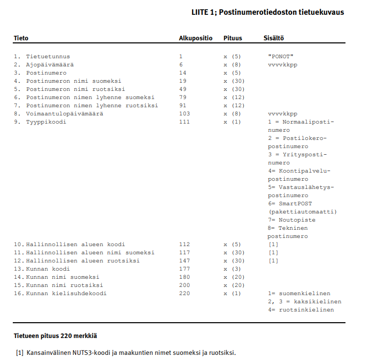

# Finnish postal codes

Machine-readable information of the postal codes of Finland is publicly available on [Posti's website](https://www.posti.fi/fi/asiakastuki/postinumerotiedostot). 

The information is described in a [PDF](https://www.posti.fi/mzj3zpe8qb7p/1eKbwM2WAEY5AuGi5TrSZ7/36bf406d5fbd322cedf0e1330f0b7dcb/postinumeropalvelut-palvelukuvaus-ja-kayttoehdot.pdf), downloaded [here](postinumeropalvelut-palvelukuvaus-ja-kayttoehdot.pdf).

The file containing the postal codes is named `PCF_yyyymmdd.zip`. The file is row-based and each row contains the following record:

Old school? Yes. This format is not very nice to work with programmatically.

